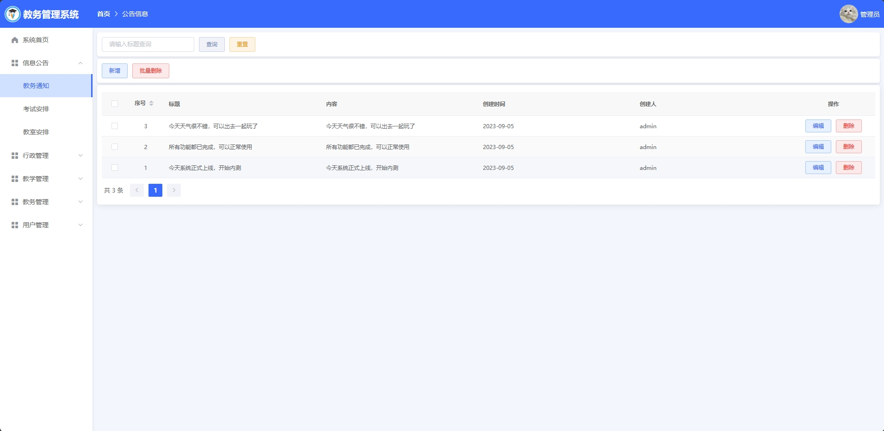
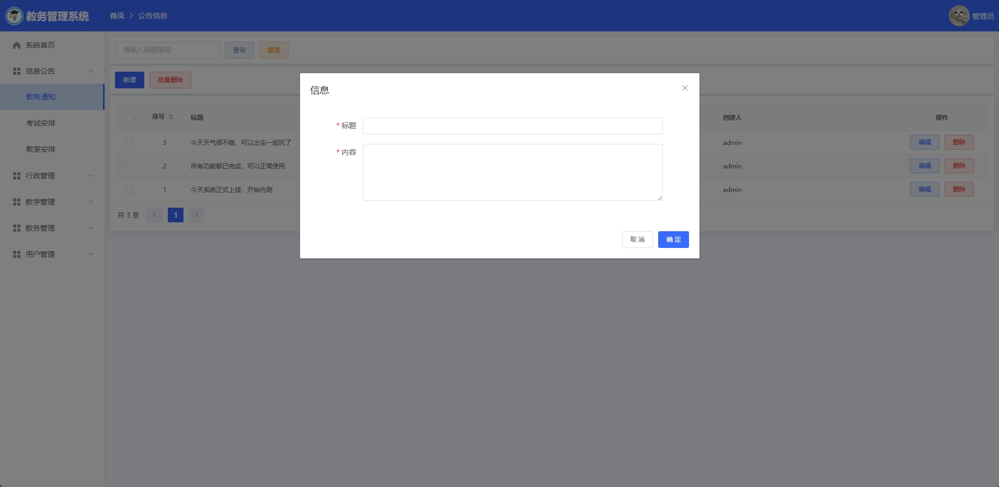
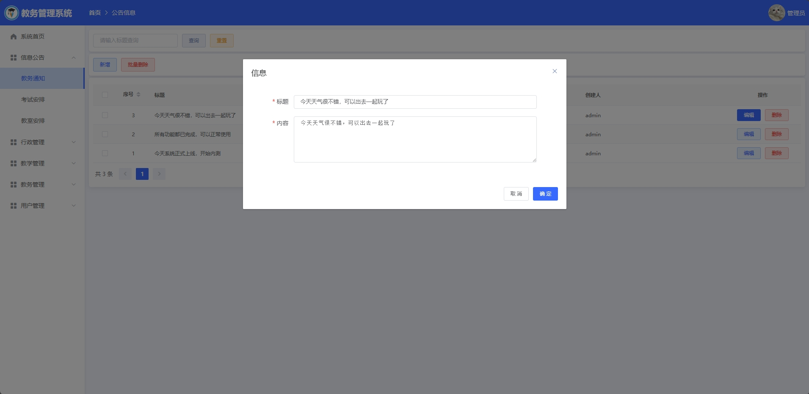
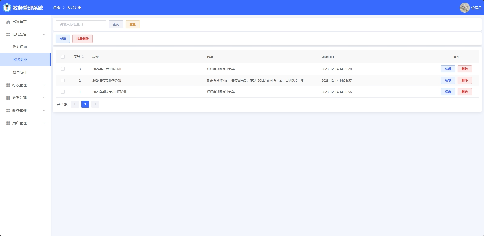
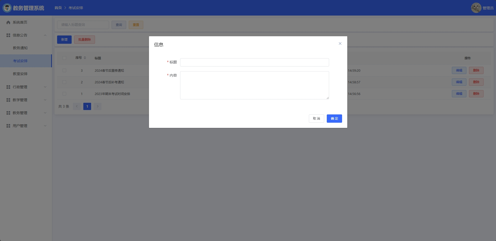

<h1 align="center">基于SSM的教务管理系统</h1>

 获取sql文件 QQ: 605739993 QQ群: 377586148 

 [个人站点: 从戎源码网](https://armycodes.com/)

## 简介

> 本代码来源于网络,仅供学习参考使用!
>
> 提供1.远程部署/2.修改代码/3.设计文档指导/4.框架代码讲解等服务
>
> 前端首页:  http://localhost:8080/
>
> 管理员: admin 密码: 123456
>
> 教师：zhang 密码: 123456
> 
> 用户：zhangsan 密码: 123456
>

## 项目介绍

基于SSM的教务管理系统：前端 Vue、ElementUI，后端 SpringBoot、Mybatis，系统角色分为：管理员、教师和用户，管理员在管理后台管理教务信息，对公告进行发布，对教室、考试进行安排，对学院、专业和班级进行管理，对课程、成绩、教评和选课管理，添加新管理员等；教师对教室安排进行查看，对学生进行打分、作业审批、考勤管理等；用户根据发布的课程进行选课、查看个人课表、查看个人成绩、上交作业等。主要功能如下：

### 启动方式

- 前端：
> cd vue
>
> npm install
>
> npm run serve

- 后端：
> 按钮启动 | 右键run SpringbootApplication

### 管理员：

- 基本操作：登录、修改个人信息、上传图片、获取个人信息、修改密码、考试安排列表、教务通知、考勤统计、成绩分布统计
- 信息公告：获取公告列表、筛选公告信息、发布公告、编辑公告、删除公告、获取考试安排列表、筛选考试安排信息、发布考试安排、编辑考试安排、删除考试安排、获取教室安排列表、筛选教室安排信息、发布教室安排、编辑教室安排、删除教室安排
- 行政管理：获取学院列表、筛选学院信息、新增学院、编辑学院信息、删除学院信息、获取专业列表、筛选专业信息、新增专业信息、编辑专业信息、删除专业信息、获取班级列表、筛选班级信息、新增班级、编辑班级信息、删除班级信息
- 教学管理：获取课程列表、筛选课程信息、新增课程、编辑课程信息、删除课程信息、获取学生选课列表、获取学生成绩列表、筛选学生成绩信息、获取教评列表、筛选教评信息、删除教评信息
- 教务管理：获取请假列表、筛选请假信息、审批请假、获取作业列表、筛选作业信息、下载作业、审批作业、获取考勤列表、筛选考勤信息
- 用户管理：获取管理员列表、筛选管理员信息、修改管理员信息、删除管理员信息、添加管理员、获取教师列表、筛选教师信息、修改教师信息、删除教师信息、添加教师、获取学生列表、筛选学生信息、修改学生信息、删除学生信息、添加学生

### 教师：

- 基本操作：登录、修改个人信息、上传图片、获取个人信息、注册用户、修改密码、考勤统计、成绩分布统计
- 教室安排：获取教室安排列表、筛选教室安排信息
- 行政管理：获取学院信息列表、筛选学院信息信息、获取专业信息列表、筛选专业信息信息、获取班级信息列表、筛选班级信息信息
- 教学管理：获取课程列表、编辑课程、筛选课程、获取学生选课情况、课程打分、打分筛选、查看教评
- 教务管理：获取课程作业列表、打分、考勤、编辑考勤、删除考勤

### 用户：

- 基本操作：登录、修改个人信息、上传图片、获取个人信息、注册用户、修改密码、考勤统计、成绩分布统计
- 教室安排：获取教室安排列表、筛选教室安排信息
- 行政管理：获取学院信息列表、筛选学院信息信息、获取专业信息列表、筛选专业信息信息、获取班级信息列表、筛选班级信息信息
- 教学管理：获取选课列表、选课、筛选选课、查看课表、查看成绩、筛选成绩、课程评价
- 教务管理：请假申请、获取请假列表、筛选请假、作业提交、删除作业、获取作业列表、筛选作业、作业下载、获取考勤列表、筛选考勤

## 环境

- <b>IntelliJ IDEA 2020.3</b>

- <b>Mysql 5.7.26</b>

- <b>NodeJs 14.17.3</b>

- <b>Maven 3.6.3</b>

- <b>JDK 1.8</b>

## 运行截图

